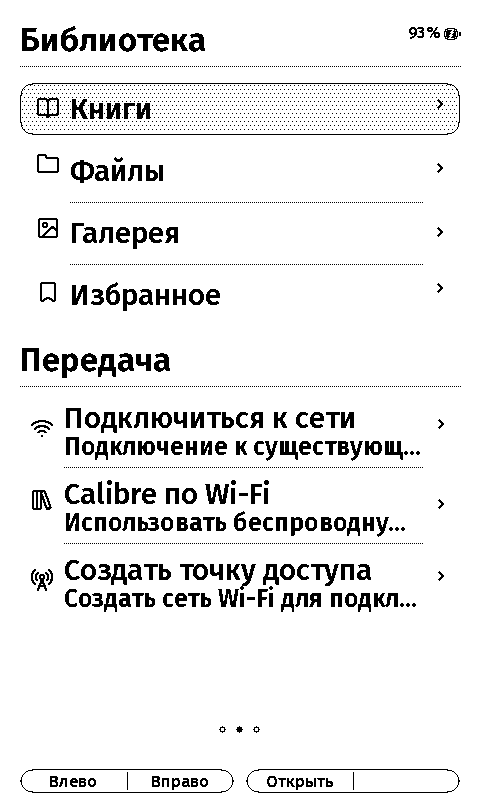
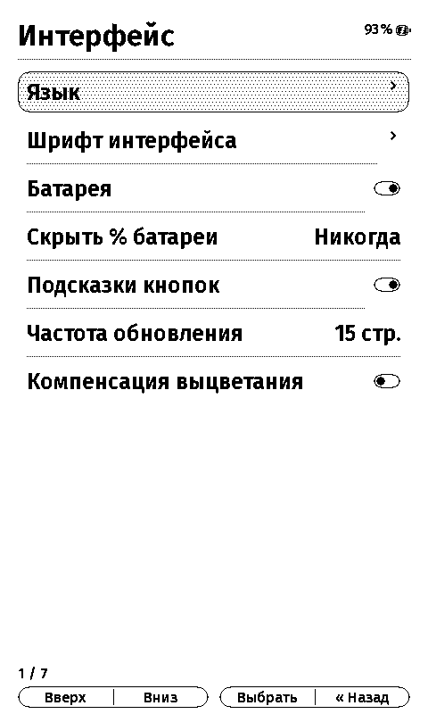

<p align="center">
  
</p>

<h1 align="center">InkPoint X</h1>

<p align="center">
  Open-source reader firmware designed for the XTEINK X4.
  <br>
  A focused library, capable file management, multilingual typography, and an e-ink-native interface.
</p>

<p align="center">
  
  
  
  <a href="LICENSE"></a>
  <a href="https://ko-fi.com/yokkivans"></a>
</p>

> [!IMPORTANT]
> The `dev` branch contains the current development firmware. For a prebuilt, user-facing binary, use the
> [Releases](https://github.com/yokki-vans/InkPointX/releases) page unless you specifically want to test development
> changes.

## Overview

InkPoint X is a complete firmware experience for the XTEINK X4 rather than a collection of isolated reader patches.
The interface, input model, font system, library, file operations, network transfer, settings, and e-ink refresh
strategy are designed as one system for the device's 480 × 800 monochrome panel and physical controls.

The project is based on [CrossPoint Reader](https://github.com/crosspoint-reader/crosspoint-reader) and keeps its
open architecture while adding an independent InkPoint X product layer, expanded document support, a redesigned
interface, and X4-specific display tuning.

### Design principles

- clear hierarchy and restrained, high-contrast layouts;
- consistent focus, headers, rows, dialogs, icons, and hardware-button legends;
- no touch assumptions, color-only states, shadows, or animation-heavy interactions;
- fast differential updates for navigation, with deliberate clean refreshes when the panel needs them;
- readable 1-bit typography and predictable behavior in every supported language.

## Interface

The home screen is organized into three horizontal pages:

1. **Now Reading** — the largest safe cover, title, author, progress, reading time, and a primary continue action.
2. **Library** — Books, Files, Gallery, Favorites, plus a dedicated Transfer subsection.
3. **Settings** — focused submenus for interface, power, reading, controls, files, network, and system options.

Selection uses a subtle rounded gray surface instead of a heavy inverted bar. Compact legends at the bottom mirror
the two physical two-section controls and always show their current assignments. The legends can be disabled in
Settings and are intentionally omitted from the reading page.

<table>
  <tr>
    <td align="center"><br><sub>Now Reading</sub></td>
    <td align="center"><br><sub>Library and Transfer</sub></td>
    <td align="center"><br><sub>Settings</sub></td>
  </tr>
</table>

The detailed interface specification is available in [docs/inkpoint-x-ui.md](docs/inkpoint-x-ui.md).

## Features

### Library and reading

- recursive book discovery on microSD;
- a Books view restricted to **EPUB**, **FB2**, and **PDF**;
- sorting by title, author, format, and recent activity;
- Favorites stored separately from the book files;
- reading progress, bookmarks, table of contents, book information, and statistics;
- configurable font, size, line spacing, margins, alignment, hyphenation, orientation, and inversion;
- automatic page turning, screenshots, QR display, OPDS, and KOReader Sync;
- support for **XTC**, **TXT**, and **Markdown** when opened from Files.

### Gallery

- discovers **BMP**, **JPEG**, and **PNG** images across the card;
- includes images and screenshots created while reading;
- opens images in a viewer adapted to the X4 display;
- uses corrected 1-bit scaling and dithering to avoid block and moiré artifacts.

### File manager

Files is a full on-device file manager, not a second book list:

- browse folders and inspect file properties;
- create folders;
- copy and move files or folders;
- rename items;
- delete files and directory trees with confirmation;
- open supported books and images directly.

### Transfer and network

- join an existing Wi-Fi network;
- receive books wirelessly from Calibre;
- create a local access point;
- upload, download, rename, move, and delete files through the web interface;
- WebDAV access;
- OPDS catalog browsing;
- OTA update support.

### Device settings

Settings are grouped by purpose rather than split across tab and “advanced” screens:

- interface language and interface font;
- button legends and battery indicator visibility;
- sleep, lock, power, and refresh behavior;
- reading defaults and reader status bar;
- button remapping;
- library and file behavior;
- Wi-Fi, OPDS, Calibre, and synchronization;
- cache maintenance, firmware update, device information, and safe settings reset.

Resetting settings preserves books, reading progress, bookmarks, statistics, recent books, and favorites.

## Typography and languages

The system interface uses **Inter Medium** for normal text and **Inter SemiBold** for headings, selection, and
emphasis, instanced from Inter's variable `wght` and `opsz` axes so each size gets its own optical treatment. Inter
carries no Hebrew or Arabic, so **Noto Sans Hebrew** and **Noto Naskh Arabic** supply exactly the code points it is
missing. Full font files are not embedded. During the build, `scripts/build_ui_fonts.py` scans every string in
`lib/I18n/translations/*.yaml` and generates compact native subsets containing only the glyphs the firmware needs.

The firmware currently provides complete UI resources for 27 languages:

<details>
<summary>Show language list</summary>

Arabic, Belarusian, Catalan, Czech, Danish, Dutch, English, Finnish, French, German, Hebrew, Hungarian, Italian,
Kazakh, Lithuanian, Polish, Portuguese (Brazil), Romanian, Russian, Slovak, Slovenian, Spanish, Swedish, Turkish,
Ukrainian, Valencian, and Vietnamese.

</details>

The text pipeline supports:

- extended Cyrillic used by Belarusian, Kazakh, Russian, and Ukrainian;
- Vietnamese diacritics and NFC composition;
- bidirectional Hebrew and Arabic text;
- contextual Arabic shaping for both translated UI strings and dynamic book, author, and file names;
- mirrored accessories and layout behavior for RTL content.

Reader fonts are independent from the UI font. Optimized `.cpfont` families can be installed in `/.fonts/` or
`/fonts/` on microSD or uploaded from the web font manager. The reader font pipeline includes a Noto Serif family
for Latin/Cyrillic/Vietnamese with Noto Naskh Arabic fallback. See
[docs/sd-card-fonts.md](docs/sd-card-fonts.md).

## E-ink behavior

InkPoint X contains an X4-specific refresh policy built around the panel's actual controller behavior:

- controller RAM is synchronized after updates so differential refreshes compare against a valid previous frame;
- interactive navigation avoids full-screen black flashes;
- explicit clean and full refresh paths are retained for recovery from accumulated ghosting;
- the first update after controller initialization uses a stronger waveform;
- grayscale and 1-bit image paths use panel-aware conversion;
- home-cover thumbnails are generated at their final layout size, avoiding a second rescale of an already-dithered
  image;
- button debounce is tuned for the X4 ADC ladder so one physical press produces one action.

E-ink cannot behave exactly like an emissive phone display, but normal navigation is designed to feel immediate
without trading away panel cleanliness.

## Installation

### Prebuilt firmware

Download `firmware.bin` from [Releases](https://github.com/yokki-vans/InkPointX/releases).

#### Recovery update from microSD

1. Format a microSD card as FAT32.
2. Copy `firmware.bin` to the root of the card.
3. Safely eject the card and insert it into the reader.
4. Power the device off.
5. Hold the **left side / Up** button while powering on.
6. Choose the firmware file in Recovery Mode and confirm the update.
7. Keep the device powered until it restarts.

#### Flash over USB

Install [esptool](https://github.com/espressif/esptool), connect the reader over USB-C, and run:

```bash
esptool --chip esp32c3 \
  --port /dev/ttyACM0 \
  --baud 921600 \
  write-flash 0x10000 firmware.bin
```

Replace `/dev/ttyACM0` with the actual serial port. On macOS it is usually named `/dev/cu.usbmodem*`.

> [!CAUTION]
> Flash only binaries built for the XTEINK X4, do not disconnect power while writing, and keep a recovery-capable
> microSD card available when testing development builds.

## Build from source

### Requirements

- Git with submodule support;
- Python 3;
- [PlatformIO Core](https://platformio.org/install/cli);
- internet access on the first build for declared toolchains, libraries, and font sources.

### Clone the development branch

```bash
git clone --branch dev --recurse-submodules https://github.com/yokki-vans/InkPointX.git
cd InkPointX
```

If the repository was cloned without submodules:

```bash
git submodule update --init --recursive
```

### Build

Development build:

```bash
pio run -e default
```

Release-style binary:

```bash
pio run -e gh_release
```

The resulting binary is:

```text
.pio/build/gh_release/firmware.bin
```

Upload directly through PlatformIO:

```bash
pio run -e gh_release --target upload
```

## Validation

Run localization and font coverage checks:

```bash
python3 scripts/validate_i18n.py
```

Run host tests:

```bash
cmake -S test -B test/build -DCMAKE_BUILD_TYPE=Release
cmake --build test/build
ctest --test-dir test/build --output-on-failure
```

Run static analysis:

```bash
pio check -e default --fail-on-defect=medium
```

The current development snapshot passes all 107 host tests, localization validation, release compilation, and
static analysis with no high- or medium-severity findings.

## Repository layout

```text
src/                         Firmware activities, settings, stores, and UI
lib/                         Readers, rendering, fonts, bidi, i18n, and HAL
open-x4-sdk/                 X4 display, input, storage, and hardware libraries
scripts/                     Code generation, font subsetting, and validation
test/                        Host-side unit and policy tests
docs/                        User, developer, attribution, and visual QA docs
platformio.ini               ESP32-C3 build environments
partitions.csv               16 MB flash partition layout
```

The `open-x4-sdk` submodule points to
[`yokki-vans/community-sdk`](https://github.com/yokki-vans/community-sdk), which contains the X4 refresh, input,
and storage fixes required by this firmware.

## Data and storage

Books stay on the microSD card. InkPoint X stores its generated caches and application data under `/.crosspoint/`.
Before testing development builds, keeping a backup of reading data and irreplaceable files is recommended.

The web interface and device file manager can modify or delete files. Destructive operations require confirmation,
but a separate backup remains the safest protection.

## Project origin and attribution

InkPoint X is derived from CrossPoint Reader and includes work from its contributors and the wider open-source
e-reader community. Third-party components, fonts, and icons retain their original licenses.

- Project license: [MIT](LICENSE)
- Third-party notices: [docs/third-party-notices.md](docs/third-party-notices.md)
- Lucide icon notice: [docs/licenses/lucide-ISC.txt](docs/licenses/lucide-ISC.txt)

## Contributing

Bug reports, hardware observations, translations, documentation improvements, and focused pull requests are
welcome. When changing the interface, validate it against the 480 × 800 framebuffer and, whenever possible, the
physical X4 panel.

Please run the relevant validation commands above before opening a pull request.

## Support

If InkPoint X is useful to you, you can support ongoing development on
[Ko-fi](https://ko-fi.com/yokkivans).
